# Movie Recommendation AI System

## 📋 **Project Overview**

### **What We're Building**
A smart movie recommendation system that suggests movies you'll actually like, based on your preferences and what similar users enjoyed.

### **Key Features**
1. **Personalized**: Different recommendations for each user
2. **Diverse**: No repetitive suggestions (not just sequels!)
3. **Works for New Users**: Even if we don't know your history yet
4. **Explainable**: Shows why each movie was recommended

### **Development Workflow**

This approach lets us experiment with the ML model freely before deploying it.

## 🏗️ **How It Works (Simple Explanation)**

### **The Big Picture**
Think of it like having two smart friends helping you pick movies:
- **Friend 1** looks at what people similar to you enjoyed
- **Friend 2** finds movies similar to ones you already liked
- Then we combine their suggestions and make sure they're not all the same genre

### **The Technical Flow**


## 📊 **Data We're Using**

### **Where We Get Our Data**
| Source | What It Gives Us | Why We Use It |
|--------|------------------|---------------|
| **MovieLens Dataset** | 25 million movie ratings from real users | Free, reliable training data |
| **TMDB API** | Movie posters, descriptions, cast | Makes recommendations look good |
| **OMDB API** | IMDb ratings | Adds credibility to suggestions |

### **What Information We Track**
- **About Users**: ID, age, preferences
- **About Movies**: Title, genre, year, cast, director, plot, ratings
- **About Interactions**: Which user rated which movie (1-5 stars)

## 🤖 **Our Machine Learning Approach**

### **Learning Type: Supervised Learning**

```mermaid
graph LR
    A[📊 Input:<br/>User-Movie Pairs] --> B[🎯 Label:<br/>Actual Ratings 1-5]
    B --> C[🧠 Model Learns:<br/>Predict Ratings]
    C --> D[✅ Output:<br/>Predicted Ratings]
    
    style A fill:#e3f2fd,stroke:#1565c0,stroke-width:2px
    style B fill:#fff3e0,stroke:#ef6c00,stroke-width:2px
    style C fill:#f3e5f5,stroke:#7b1fa2,stroke-width:2px
    style D fill:#e8f5e9,stroke:#2e7d32,stroke-width:2px
```


> **Why Supervised?** We have labeled data (actual user ratings), so the model learns by comparing its predictions to real ratings and improving over time.

### **System Architecture**


### **Why Use Two Methods Together?**
We combine two techniques for better results:

| Method | What It Does | Strength | Weakness |
|--------|--------------|----------|----------|
| **Collaborative Filtering** | Finds users like you and recommends what they liked | Great at finding hidden patterns | Struggles with brand new movies |
| **Content-Based Filtering** | Finds movies similar to ones you enjoyed | Works even for new movies | Only suggests similar things |
| **Our Hybrid Model** | Uses both methods together | **Best of both worlds** | Slightly more complex |

### **The Three Components**

#### **1. Collaborative Filtering (Finding Similar Users)**
- **What**: Looks at patterns in how people rate movies
- **How**: Uses Matrix Factorization (SVD algorithm)
- **Example**: "People who liked *Inception* also enjoyed *Interstellar*"
- **Library**: Surprise (Python)

#### **2. Content-Based Filtering (Finding Similar Movies)**
- **What**: Compares movie features (genre, director, plot)
- **How**: Uses text similarity (TF-IDF + Cosine Similarity)
- **Example**: "Both movies are sci-fi thrillers by Christopher Nolan"

#### **3. Diversity Module (Adding Variety)**
- **What**: Makes sure we don't recommend only sequels
- **How**: Uses MMR algorithm to balance similarity and variety
- **Example**: If you liked *Ice Age*, we'll suggest some animated movies BUT also some different genres

## 🔬 **Training Process (Google Colab)**

### **Training Pipeline**

```mermaid
flowchart TD
    A[📥 Load MovieLens Data] --> B[🧹 Clean & Preprocess]
    B --> C[🔧 Feature Engineering]
    
    C --> D[🤝 Train Collaborative<br/>Filtering SVD]
    C --> E[🎬 Train Content-Based<br/>Model TF-IDF]
    
    D --> F{✅ Evaluate<br/>Performance}
    E --> F
    
    F -->|RMSE < 0.90| G[💾 Save Models<br/>.pkl files]
    F -->|RMSE ≥ 0.90| H[🔄 Tune Parameters]
    H --> D
    
    G --> I[📦 Export Models<br/>cf_model.pkl<br/>content_model.pkl]
    
    style A fill:#e3f2fd
    style C fill:#f3e5f5
    style D fill:#fff3e0
    style E fill:#fff3e0
    style F fill:#ffebee
    style G fill:#c8e6c9
    style I fill:#c8e6c9
```


### **Why Train on Colab?**
- **Free GPU access** for faster training
- **Can experiment freely** without affecting our web app
- **Easy to visualize** model performance at each step
- **Notebook format** lets us explore the ML process step-by-step

### **Training Steps**
```python
# Step 1: Load and prepare data
movies, ratings = load_movielens_data()

# Step 2: Create features
movie_features = extract_features(movies)  # genres, plot, cast

# Step 3: Train collaborative filtering
cf_model = SVD()
cf_model.fit(ratings)

# Step 4: Train content-based model
content_model = ContentBased()
content_model.fit(movie_features)

# Step 5: Test the models
evaluate_models(cf_model, content_model, test_data)

# Step 6: Save trained models
save_model(cf_model, 'cf_model.pkl')
save_model(content_model, 'content_model.pkl')
```

### **What We'll Export from Colab**
After training, we download:
- `cf_model.pkl` - The collaborative filtering model
- `content_model.pkl` - The content-based model  
- `movie_features.pkl` - Pre-processed movie data
- `vectorizer.pkl` - Text processing tool

## 🛡️ **Making Sure Our Model Works Well**

### **Data Split Strategy**


### **The Problem: Overfitting**
Overfitting = Model memorizes training data instead of learning patterns
**Example**: Model thinks all users who rated *Toy Story* 5 stars will love *Toy Story 2*, but real users want variety

### **How We Prevent It**

| Technique | What It Means | Why It Helps |
|-----------|---------------|--------------|
| **Data Split (70-15-15)** | Train on 70%, validate on 15%, test on 15% | Check if model works on new data |
| **Early Stopping** | Stop training when validation gets worse | Prevents memorization |
| **Regularization** | Penalize overly complex patterns | Keeps model simple |

### **Simple Early Stopping Example**
```python
# Train until model stops improving
best_score = 0
patience = 5  # Wait 5 rounds before giving up

for round in training:
    train_model()
    score = test_on_validation_data()
    
    if score > best_score:
        best_score = score
        save_model()  # This is our best model!
    else:
        patience -= 1
        
    if patience == 0:
        break  # Stop training, use saved model
```

## 📈 **How We Measure Success**

### **Main Metrics (What We Track in Colab)**

| Metric | What It Measures | Good Score | In Simple Terms |
|--------|------------------|------------|-----------------|
| **RMSE** | Prediction accuracy | < 0.90 | "How close are our predictions to real ratings?" |
| **Precision@10** | Quality of top 10 | > 40% | "How many of our top 10 are actually good?" |
| **Diversity** | Variety in recommendations | < 0.70 similarity | "Are we recommending different types of movies?" |

### **What Success Looks Like**
- ✅ Predictions are close to actual ratings (RMSE < 0.90)
- ✅ At least 4 out of 10 recommendations are relevant
- ✅ Recommendations include different genres
- ✅ Model responds in under 2 seconds

## 🔄 **Solving the Repetition Problem**

### **The Problem**
User watches *Ice Age* → System only recommends *Ice Age 2, 3, 4, 5*... boring!

### **Our Solution**
```python
def create_diverse_recommendations(user):
    # Get 20 potential recommendations
    candidates = get_top_20_similar_movies(user)
    
    # Pick top 7 most relevant
    recommendations = candidates[:7]
    
    # Add 3 "surprise" movies (different genres but still good)
    surprises = find_surprising_good_movies(user, count=3)
    
    # Final list: 7 similar + 3 different = 10 diverse picks
    return recommendations + surprises
```

**Result**: User gets familiar picks + some new discoveries!

## 🌐 **Web Integration (After Training)**

### **How The Web App Will Work**


### **Loading the Trained Model**
```python
import pickle

# Load models we trained on Colab
cf_model = pickle.load(open('cf_model.pkl', 'rb'))
content_model = pickle.load(open('content_model.pkl', 'rb'))

def get_recommendations(user_id):
    # Use our pre-trained models
    recs = cf_model.predict(user_id, n=20)
    recs = content_model.diversify(recs)
    return recs[:10]
```

### **Getting Movie Posters & Info**
```python
import requests

def get_movie_poster(movie_title):
    url = "https://api.themoviedb.org/3/search/movie"
    response = requests.get(url, params={'query': movie_title})
    return response.json()['poster_url']
```

## 🚀 **Project Structure**

### **Overall Architecture**

```mermaid
graph TB
    subgraph Colab["☁️ Google Colab - Training Phase"]
        A[Data Exploration] --> B[Preprocessing]
        B --> C[Model Training]
        C --> D[Evaluation]
        D --> E[Export Models]
    end
    
    subgraph Local["💻 Local/Web - Deployment Phase"]
        F[Load Models] --> G[Web Interface]
        G --> H[Generate Recommendations]
        H --> I[Fetch from APIs]
        I --> J[Display Results]
    end
    
    E -->|Download .pkl files| F
    
    style Colab fill:#e8eaf6,stroke:#3f51b5,stroke-width:2px
    style Local fill:#e8f5e9,stroke:#4caf50,stroke-width:2px
    style E fill:#fff9c4,stroke:#f57f17,stroke-width:2px
    style F fill:#fff9c4,stroke:#f57f17,stroke-width:2px
```


### **Two Separate Parts**

#### **Part 1: Training (Google Colab)**
```
colab_notebooks/
├── 01_data_exploration.ipynb      # Explore the MovieLens data
├── 02_data_preprocessing.ipynb    # Clean and prepare data
├── 03_model_training.ipynb        # Train collaborative & content models
├── 04_model_evaluation.ipynb      # Test performance
└── 05_export_models.ipynb         # Save models to download
```

#### **Part 2: Web App (Local/Deployment)**
```
movie-recommender-web/
├── models/                    # Downloaded from Colab
│   ├── cf_model.pkl
│   ├── content_model.pkl
│   └── movie_features.pkl
├── app.py                     # Web application (Flask/Streamlit)
├── requirements.txt
└── config.yaml               # API keys (TMDB, OMDB)
```

### **Why This Structure?**
- ✅ **Colab**: Free GPU, experiment freely, visual feedback
- ✅ **Web App**: Lightweight, just loads pre-trained models
- ✅ **Separation**: Can retrain model without touching web code

## 📋 **Term Glossary**

| Term | Simple Explanation |
|------|-------------------|
| **SVD** | Method to find hidden patterns in user ratings |
| **TF-IDF** | Way to understand which words are important in movie descriptions |
| **RMSE** | Measures how accurate our predictions are (lower = better) |
| **API** | A way to get data from other websites (like movie posters) |
| **Cold-Start** | Problem when recommending to brand new users with no history |
| **Overfitting** | When model memorizes instead of learning (bad!) |
| **Collaborative Filtering** | "People like you also liked..." |
| **Content-Based** | "Movies similar to what you watched..." |
| **Pickle (.pkl)** | File format to save trained Python models |

## ⚖️ **Why We Chose This Approach**

### **What We Considered**

| Approach | Pros | Cons | Our Decision |
|----------|------|------|--------------|
| **Deep Learning (Neural Networks)** | Very powerful | Needs tons of data & computing power | ❌ Too complex for now |
| **Only "Similar Users"** | Simple to implement | Can't handle new movies | ❌ Not flexible enough |
| **Only "Similar Movies"** | Works for new movies | Repetitive suggestions | ❌ Too boring |
| **Our Hybrid Model** | Balanced & practical | Slightly more work | ✅ **Best choice** |

### **What's Great About Our Solution**
- ✅ Good accuracy without being overly complex
- ✅ Can explain why we recommended each movie
- ✅ Works even with new users/movies
- ✅ Runs on free resources (Colab)

### **Known Limitations**
- Needs some user rating data to work well
- Free API limits (but enough for a project)
- Movie taste is subjective - can't please everyone!

## 🎯 **What We'll Deliver**

### **From Colab Training**
- ✅ Well-trained model with RMSE < 0.90
- ✅ Detailed notebook showing each ML step
- ✅ Performance visualizations and metrics
- ✅ Downloadable model files (.pkl)

### **From Web Application**
- ✅ Clean interface to enter movie preferences
- ✅ 10 personalized movie recommendations
- ✅ Movie posters and ratings displayed
- ✅ Explanation: "Recommended because you liked X"
- ✅ Fast response (under 2 seconds)

## 📚 **Tools & Resources**

### **Python Libraries We'll Use**
| Library | Purpose |
|---------|---------|
| **pandas** | Data manipulation |
| **numpy** | Math operations |
| **scikit-learn** | ML algorithms & tools |
| **surprise** | Recommendation algorithms (SVD) |
| **Flask/Streamlit** | Web interface |
| **requests** | API calls |
| **pickle** | Save/load models |

### **Data Sources**
- **MovieLens 25M**: Free dataset with 25 million ratings
- **TMDB API**: Movie posters and metadata (free tier)
- **OMDB API**: IMDb ratings (free tier)

### **Helpful Resources**
- Google Colab for free GPU training
- MovieLens dataset documentation
- Surprise library documentation

---

## ✅ **Development Workflow**


### **Phase 1: Training on Google Colab** 
1. Open Google Colab (free account)
2. Upload/connect to MovieLens dataset
3. Run notebooks step-by-step:
   - Explore data
   - Clean data
   - Train collaborative filtering model
   - Train content-based model
   - Evaluate performance
   - Visualize results
4. Download trained models (.pkl files)

### **Phase 2: Building the Web App**
```bash
# 1. Clone repository
git clone <repo-url>

# 2. Install dependencies
pip install -r requirements.txt

# 3. Add your trained models to /models/ folder

# 4. Get API keys (free)
#    - TMDB: https://www.themoviedb.org/settings/api
#    - OMDB: http://www.omdbapi.com/apikey.aspx

# 5. Add keys to config.yaml

# 6. Run the app
streamlit run app.py
```

### **Phase 3: Testing & Iteration**
- Test with different user preferences
- Adjust diversity settings if needed
- Improve UI based on feedback

---

## 🎓 **Learning Outcomes**

### **Skills Gained**


By completing this project, we'll understand:
- How recommendation systems work in real-world apps (Netflix, YouTube)
- Collaborative filtering vs Content-based filtering
- How to train ML models on Google Colab
- How to integrate ML models into web applications
- How to evaluate ML model performance
- How to work with APIs (TMDB, OMDB)

---

*This README explains our movie recommendation system in simple terms. The workflow is: train on Colab → download models → integrate into web app.*