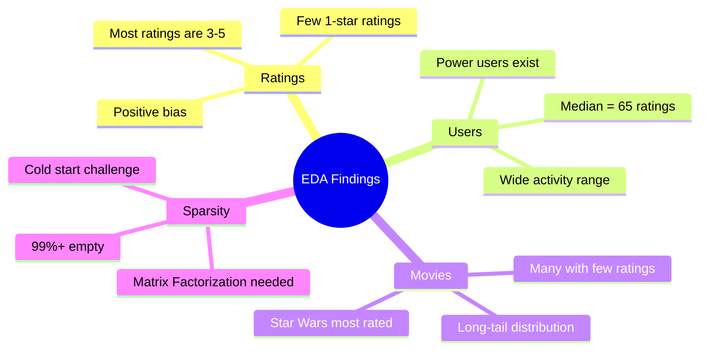

# 📊 Step 2: Data Exploration (EDA)

## 🎯 **Objective**
Understand our MovieLens dataset through visualizations and statistics. We need to know our data before building any model!

---

## 📋 **What We'll Discover**
1. How are ratings distributed? (Are most ratings high or low?)
2. How active are users? (Do some users rate way more than others?)
3. How popular are different movies? (Are some movies rated by everyone?)
4. What genres are most common?
5. Is our data sparse? (Most user-movie combinations are empty)

---

## 🤔 **Why EDA Matters for Recommendation Systems**

| What We Learn | Why It's Important |
|---------------|-------------------|
| Rating distribution | Know if users tend to rate high/low (bias) |
| User activity | Identify power users vs casual users |
| Movie popularity | Popular movies are easier to recommend |
| Data sparsity | Understand the "cold start" challenge |
| Genre distribution | Ensure we have diverse movies |

---

## 💻 **Code Cells**

### **Cell 1: Load Data (Run After Setup)**

```python
# ============================================
# LOAD DATA (Run if starting fresh)
# ============================================

import pandas as pd
import numpy as np
import matplotlib.pyplot as plt
import seaborn as sns
import os

# Set paths (using Colab temp storage)
PROJECT_DIR = '/content/MovieRecommender'
DATA_DIR = f'{PROJECT_DIR}/data'
PLOTS_DIR = f'{PROJECT_DIR}/plots'
EXTRACT_PATH = f'{DATA_DIR}/ml-100k'

# Load ratings
ratings_df = pd.read_csv(
    f"{EXTRACT_PATH}/u.data",
    sep='\t',
    names=['user_id', 'movie_id', 'rating', 'timestamp'],
    encoding='latin-1'
)

# Load movies
movies_df = pd.read_csv(
    f"{EXTRACT_PATH}/u.item",
    sep='|',
    encoding='latin-1',
    names=['movie_id', 'title', 'release_date', 'video_release', 'imdb_url',
           'unknown', 'Action', 'Adventure', 'Animation', 'Children', 'Comedy',
           'Crime', 'Documentary', 'Drama', 'Fantasy', 'Film-Noir', 'Horror',
           'Musical', 'Mystery', 'Romance', 'Sci-Fi', 'Thriller', 'War', 'Western']
)

# Load user demographics
users_df = pd.read_csv(
    f"{EXTRACT_PATH}/u.user",
    sep='|',
    names=['user_id', 'age', 'gender', 'occupation', 'zip_code'],
    encoding='latin-1'
)

# Set plotting style
plt.style.use('seaborn-v0_8-whitegrid')
sns.set_palette("husl")

print("✅ Data loaded successfully!")
print(f"📊 Ratings: {len(ratings_df):,} | Movies: {len(movies_df):,} | Users: {len(users_df):,}")
```

---

### **Cell 2: Dataset Overview**

```python
# ============================================
# DATASET OVERVIEW
# ============================================

print("=" * 60)
print("📊 DATASET OVERVIEW")
print("=" * 60)

# Basic statistics
n_users = ratings_df['user_id'].nunique()
n_movies = ratings_df['movie_id'].nunique()
n_ratings = len(ratings_df)
sparsity = 1 - (n_ratings / (n_users * n_movies))

print(f"""
📈 KEY STATISTICS
─────────────────────────────
👥 Unique Users:     {n_users:,}
🎬 Unique Movies:    {n_movies:,}
⭐ Total Ratings:    {n_ratings:,}
📊 Avg Rating:       {ratings_df['rating'].mean():.2f}
📉 Min Rating:       {ratings_df['rating'].min()}
📈 Max Rating:       {ratings_df['rating'].max()}
🔲 Matrix Sparsity:  {sparsity:.2%}

💡 INTERPRETATION
─────────────────────────────
• Sparsity of {sparsity:.2%} means {sparsity*100:.1f}% of all possible 
  user-movie combinations have NO rating
• This is the "sparse matrix" problem - we need to predict 
  these missing ratings!
• Our model will try to fill in the {(n_users * n_movies - n_ratings):,} 
  missing entries
""")
```

**📝 Explanation:**
- **Sparsity**: In real-world recommendation systems, most users haven't rated most items
- With 99%+ sparsity, we're predicting ratings for combinations we've never seen
- This is exactly why we need machine learning - simple rules won't work!

---

### **Cell 3: Rating Distribution - Histogram**

```python
# ============================================
# RATING DISTRIBUTION
# ============================================

fig, axes = plt.subplots(1, 2, figsize=(14, 5))

# Plot 1: Count of each rating
ax1 = axes[0]
rating_counts = ratings_df['rating'].value_counts().sort_index()
colors = sns.color_palette("RdYlGn", 5)  # Red to Green

bars = ax1.bar(rating_counts.index, rating_counts.values, color=colors, edgecolor='black')
ax1.set_xlabel('Rating', fontsize=12)
ax1.set_ylabel('Count', fontsize=12)
ax1.set_title('Distribution of Ratings', fontsize=14, fontweight='bold')
ax1.set_xticks([1, 2, 3, 4, 5])

# Add count labels on bars
for bar, count in zip(bars, rating_counts.values):
    ax1.text(bar.get_x() + bar.get_width()/2, bar.get_height() + 500, 
             f'{count:,}', ha='center', fontsize=10)

# Plot 2: Percentage breakdown
ax2 = axes[1]
percentages = (rating_counts / rating_counts.sum() * 100)
wedges, texts, autotexts = ax2.pie(
    percentages, 
    labels=[f'⭐ {i}' for i in range(1, 6)],
    autopct='%1.1f%%',
    colors=colors,
    explode=[0.02]*5,
    startangle=90
)
ax2.set_title('Rating Percentage Breakdown', fontsize=14, fontweight='bold')

plt.tight_layout()
plt.savefig(f'{PLOTS_DIR}/01_rating_distribution.png', dpi=150, bbox_inches='tight')
plt.show()

# Print insights
print("""
📊 INSIGHTS FROM RATING DISTRIBUTION
────────────────────────────────────
""")
mode_rating = rating_counts.idxmax()
print(f"• Most common rating: ⭐ {mode_rating} ({rating_counts[mode_rating]:,} times)")
print(f"• Users tend to rate movies they LIKE (positive bias)")
print(f"• Very few 1-star ratings - people don't bother rating bad movies")
print(f"• This is typical in recommendation systems!")
```

**📝 Explanation:**
- **Positive Bias**: Users mostly rate movies 3-5 stars
- People don't usually rate movies they hate - they just don't watch them
- Our model needs to account for this bias (not assume 3 stars = neutral)

---

### **Cell 4: User Activity Analysis**

```python
# ============================================
# USER ACTIVITY ANALYSIS
# ============================================

# Count ratings per user
user_activity = ratings_df.groupby('user_id').size().reset_index(name='num_ratings')

fig, axes = plt.subplots(1, 2, figsize=(14, 5))

# Plot 1: Distribution of ratings per user
ax1 = axes[0]
ax1.hist(user_activity['num_ratings'], bins=50, color='steelblue', edgecolor='white', alpha=0.7)
ax1.axvline(user_activity['num_ratings'].median(), color='red', linestyle='--', 
            label=f'Median: {user_activity["num_ratings"].median():.0f}')
ax1.axvline(user_activity['num_ratings'].mean(), color='orange', linestyle='--', 
            label=f'Mean: {user_activity["num_ratings"].mean():.0f}')
ax1.set_xlabel('Number of Ratings per User', fontsize=12)
ax1.set_ylabel('Number of Users', fontsize=12)
ax1.set_title('User Activity Distribution', fontsize=14, fontweight='bold')
ax1.legend()

# Plot 2: Top 20 most active users
ax2 = axes[1]
top_users = user_activity.nlargest(20, 'num_ratings')
ax2.barh(range(20), top_users['num_ratings'].values, color='coral')
ax2.set_yticks(range(20))
ax2.set_yticklabels([f"User {uid}" for uid in top_users['user_id']])
ax2.set_xlabel('Number of Ratings', fontsize=12)
ax2.set_title('Top 20 Most Active Users', fontsize=14, fontweight='bold')
ax2.invert_yaxis()

plt.tight_layout()
plt.savefig(f'{PLOTS_DIR}/02_user_activity.png', dpi=150, bbox_inches='tight')
plt.show()

# Statistics
print("""
👥 USER ACTIVITY INSIGHTS
────────────────────────────────────
""")
print(f"• Most active user: {top_users.iloc[0]['num_ratings']:,} ratings")
print(f"• Least active user: {user_activity['num_ratings'].min()} ratings")
print(f"• Average ratings/user: {user_activity['num_ratings'].mean():.1f}")
print(f"• Median ratings/user: {user_activity['num_ratings'].median():.0f}")
print(f"\n💡 Some users rate 10x more than others - 'power users'")
print(f"💡 We should ensure our model works for BOTH active and casual users")
```

**📝 Explanation:**
- **Power Users**: Some users rate hundreds of movies, others just a few
- The median is often lower than the mean (right-skewed distribution)
- Challenge: Make good recommendations even for users with few ratings

---

### **Cell 5: Movie Popularity Analysis**

```python
# ============================================
# MOVIE POPULARITY ANALYSIS
# ============================================

# Count ratings per movie
movie_popularity = ratings_df.groupby('movie_id').agg({
    'rating': ['count', 'mean']
}).reset_index()
movie_popularity.columns = ['movie_id', 'num_ratings', 'avg_rating']

# Merge with movie titles
movie_popularity = movie_popularity.merge(movies_df[['movie_id', 'title']], on='movie_id')

fig, axes = plt.subplots(1, 2, figsize=(14, 5))

# Plot 1: Distribution of ratings per movie
ax1 = axes[0]
ax1.hist(movie_popularity['num_ratings'], bins=50, color='mediumpurple', edgecolor='white', alpha=0.7)
ax1.axvline(movie_popularity['num_ratings'].median(), color='red', linestyle='--', 
            label=f'Median: {movie_popularity["num_ratings"].median():.0f}')
ax1.set_xlabel('Number of Ratings per Movie', fontsize=12)
ax1.set_ylabel('Number of Movies', fontsize=12)
ax1.set_title('Movie Popularity Distribution', fontsize=14, fontweight='bold')
ax1.legend()

# Plot 2: Top 15 most rated movies
ax2 = axes[1]
top_movies = movie_popularity.nlargest(15, 'num_ratings')
bars = ax2.barh(range(15), top_movies['num_ratings'].values, color='mediumseagreen')
ax2.set_yticks(range(15))
ax2.set_yticklabels([title[:30] + '...' if len(title) > 30 else title 
                      for title in top_movies['title']])
ax2.set_xlabel('Number of Ratings', fontsize=12)
ax2.set_title('Top 15 Most Popular Movies', fontsize=14, fontweight='bold')
ax2.invert_yaxis()

plt.tight_layout()
plt.savefig(f'{PLOTS_DIR}/03_movie_popularity.png', dpi=150, bbox_inches='tight')
plt.show()

# Display top movies
print("🎬 TOP 10 MOST RATED MOVIES")
print("─" * 50)
for i, row in top_movies.head(10).iterrows():
    print(f"  {row['title'][:40]}: {row['num_ratings']} ratings (avg: {row['avg_rating']:.2f}⭐)")
```

**📝 Explanation:**
- **Long-tail Distribution**: A few movies are rated by almost everyone (Star Wars, Toy Story)
- Most movies have very few ratings
- This causes the "popularity bias" - easy to recommend popular movies, harder for niche ones

---

### **Cell 6: Genre Distribution**

```python
# ============================================
# GENRE DISTRIBUTION
# ============================================

# Genre columns
genre_cols = ['Action', 'Adventure', 'Animation', 'Children', 'Comedy', 
              'Crime', 'Documentary', 'Drama', 'Fantasy', 'Film-Noir', 
              'Horror', 'Musical', 'Mystery', 'Romance', 'Sci-Fi', 
              'Thriller', 'War', 'Western']

# Count movies per genre
genre_counts = movies_df[genre_cols].sum().sort_values(ascending=True)

# Create plot
fig, ax = plt.subplots(figsize=(10, 8))

colors = plt.cm.viridis(np.linspace(0.2, 0.8, len(genre_counts)))
bars = ax.barh(genre_counts.index, genre_counts.values, color=colors)
ax.set_xlabel('Number of Movies', fontsize=12)
ax.set_title('Number of Movies per Genre', fontsize=14, fontweight='bold')

# Add value labels
for bar, count in zip(bars, genre_counts.values):
    ax.text(bar.get_width() + 5, bar.get_y() + bar.get_height()/2, 
            str(count), va='center', fontsize=10)

plt.tight_layout()
plt.savefig(f'{PLOTS_DIR}/04_genre_distribution.png', dpi=150, bbox_inches='tight')
plt.show()

print("""
🎭 GENRE INSIGHTS
────────────────────────────────────
""")
print(f"• Most common genre: {genre_counts.idxmax()} ({genre_counts.max()} movies)")
print(f"• Least common genre: {genre_counts.idxmin()} ({genre_counts.min()} movies)")
print(f"• Average genres per movie: {movies_df[genre_cols].sum(axis=1).mean():.1f}")
print(f"\n💡 Movies can have multiple genres (e.g., Action + Sci-Fi)")
print(f"💡 Drama and Comedy dominate - common in real-world movie distributions")
```

---

### **Cell 7: Average Rating by Genre**

```python
# ============================================
# AVERAGE RATING BY GENRE
# ============================================

# Merge ratings with movies
ratings_with_genres = ratings_df.merge(movies_df[['movie_id'] + genre_cols], on='movie_id')

# Calculate average rating per genre
genre_avg_ratings = {}
for genre in genre_cols:
    genre_ratings = ratings_with_genres[ratings_with_genres[genre] == 1]['rating']
    genre_avg_ratings[genre] = genre_ratings.mean()

genre_avg_df = pd.DataFrame({
    'genre': genre_avg_ratings.keys(),
    'avg_rating': genre_avg_ratings.values()
}).sort_values('avg_rating', ascending=True)

# Plot
fig, ax = plt.subplots(figsize=(10, 8))

colors = plt.cm.RdYlGn(np.linspace(0.2, 0.8, len(genre_avg_df)))
bars = ax.barh(genre_avg_df['genre'], genre_avg_df['avg_rating'], color=colors)

# Add vertical line for overall average
overall_avg = ratings_df['rating'].mean()
ax.axvline(overall_avg, color='red', linestyle='--', linewidth=2, 
           label=f'Overall Avg: {overall_avg:.2f}')

ax.set_xlabel('Average Rating', fontsize=12)
ax.set_title('Average Rating by Genre', fontsize=14, fontweight='bold')
ax.set_xlim(3.0, 4.0)  # Zoom in on the relevant range
ax.legend()

# Add value labels
for bar, rating in zip(bars, genre_avg_df['avg_rating']):
    ax.text(bar.get_width() + 0.01, bar.get_y() + bar.get_height()/2, 
            f'{rating:.2f}', va='center', fontsize=10)

plt.tight_layout()
plt.savefig(f'{PLOTS_DIR}/05_genre_avg_rating.png', dpi=150, bbox_inches='tight')
plt.show()

print(f"""
⭐ RATING BY GENRE INSIGHTS
────────────────────────────────────
• Highest rated genre: {genre_avg_df.iloc[-1]['genre']} ({genre_avg_df.iloc[-1]['avg_rating']:.2f}⭐)
• Lowest rated genre: {genre_avg_df.iloc[0]['genre']} ({genre_avg_df.iloc[0]['avg_rating']:.2f}⭐)
• All genres average between 3.0-4.0 (positive bias effect)
""")
```

---

### **Cell 8: Sparsity Matrix Visualization**

```python
# ============================================
# SPARSITY VISUALIZATION (Sample)
# ============================================

# Take a sample for visualization (full matrix too large)
sample_users = ratings_df['user_id'].unique()[:50]
sample_movies = ratings_df['movie_id'].unique()[:100]

sample_ratings = ratings_df[
    (ratings_df['user_id'].isin(sample_users)) & 
    (ratings_df['movie_id'].isin(sample_movies))
]

# Create matrix
matrix = sample_ratings.pivot_table(
    index='user_id', 
    columns='movie_id', 
    values='rating', 
    fill_value=0
)

# Plot heatmap
fig, ax = plt.subplots(figsize=(14, 8))

sns.heatmap(
    matrix, 
    cmap='YlOrRd', 
    cbar_kws={'label': 'Rating'},
    ax=ax
)
ax.set_title('User-Movie Rating Matrix (50 users × 100 movies sample)', 
             fontsize=14, fontweight='bold')
ax.set_xlabel('Movie ID', fontsize=12)
ax.set_ylabel('User ID', fontsize=12)

plt.tight_layout()
plt.savefig(f'{PLOTS_DIR}/06_sparsity_matrix.png', dpi=150, bbox_inches='tight')
plt.show()

# Calculate sample sparsity
filled = (matrix > 0).sum().sum()
total = matrix.shape[0] * matrix.shape[1]
sample_sparsity = 1 - (filled / total)

print(f"""
🔲 SPARSITY VISUALIZATION
────────────────────────────────────
• White/light areas = NO RATING (missing data)
• Colored areas = RATED (our training data)
• Sample sparsity: {sample_sparsity:.1%}

💡 WHAT THIS MEANS FOR OUR MODEL:
• Our model needs to PREDICT the white areas
• This is why we use Matrix Factorization (SVD)
• SVD finds hidden patterns to fill the gaps
""")
```

**📝 Explanation:**
- The heatmap shows mostly empty spaces (white) - this is the sparsity problem
- Our ML model's job is to predict ratings for these empty spaces
- Matrix Factorization (SVD) learns hidden factors that explain rating patterns

---

### **Cell 9: User Demographics Analysis**

```python
# ============================================
# USER DEMOGRAPHICS
# ============================================

fig, axes = plt.subplots(1, 3, figsize=(15, 5))

# Plot 1: Age distribution
ax1 = axes[0]
ax1.hist(users_df['age'], bins=20, color='skyblue', edgecolor='white')
ax1.set_xlabel('Age', fontsize=12)
ax1.set_ylabel('Number of Users', fontsize=12)
ax1.set_title('User Age Distribution', fontsize=14, fontweight='bold')
ax1.axvline(users_df['age'].median(), color='red', linestyle='--', 
            label=f"Median: {users_df['age'].median()}")
ax1.legend()

# Plot 2: Gender distribution
ax2 = axes[1]
gender_counts = users_df['gender'].value_counts()
ax2.pie(gender_counts, labels=['Male', 'Female'], autopct='%1.1f%%',
        colors=['steelblue', 'coral'], explode=[0.02, 0.02])
ax2.set_title('Gender Distribution', fontsize=14, fontweight='bold')

# Plot 3: Top occupations
ax3 = axes[2]
occupation_counts = users_df['occupation'].value_counts().head(10)
ax3.barh(occupation_counts.index, occupation_counts.values, color='mediumpurple')
ax3.set_xlabel('Number of Users', fontsize=12)
ax3.set_title('Top 10 Occupations', fontsize=14, fontweight='bold')
ax3.invert_yaxis()

plt.tight_layout()
plt.savefig(f'{PLOTS_DIR}/07_user_demographics.png', dpi=150, bbox_inches='tight')
plt.show()

print("""
👥 DEMOGRAPHIC INSIGHTS
────────────────────────────────────
• Dataset has more male users (typical for 1990s movie datasets)
• Most users are young adults (students, programmers)
• This may bias recommendations toward certain movie types
""")
```

---

### **Cell 10: Summary Statistics - Save for Report**

```python
# ============================================
# SAVE EDA SUMMARY
# ============================================

eda_summary = f"""
# 📊 EXPLORATORY DATA ANALYSIS SUMMARY
Generated: {pd.Timestamp.now().strftime('%Y-%m-%d %H:%M')}

## Dataset Overview
- **Total Ratings**: {n_ratings:,}
- **Unique Users**: {n_users:,}
- **Unique Movies**: {n_movies:,}
- **Matrix Sparsity**: {sparsity:.2%}

## Rating Statistics
- **Mean Rating**: {ratings_df['rating'].mean():.2f}
- **Median Rating**: {ratings_df['rating'].median():.0f}
- **Most Common Rating**: {rating_counts.idxmax()} ({rating_counts.max():,} occurrences)

## User Statistics
- **Avg Ratings per User**: {user_activity['num_ratings'].mean():.1f}
- **Most Active User**: {user_activity['num_ratings'].max()} ratings
- **Least Active User**: {user_activity['num_ratings'].min()} ratings

## Movie Statistics
- **Avg Ratings per Movie**: {movie_popularity['num_ratings'].mean():.1f}
- **Most Popular Movie**: {movie_popularity.nlargest(1, 'num_ratings')['title'].values[0]}
- **Most Common Genre**: {genre_counts.idxmax()}

## Key Findings
1. **Positive Bias**: Users rate mostly 3-5 stars
2. **Sparsity Problem**: ~{sparsity*100:.0f}% of ratings are missing
3. **Power Users**: Some users rate 10x more than average
4. **Popularity Bias**: Few movies get most ratings
5. **Genre Imbalance**: Drama/Comedy dominate

## Implications for Model
- Need to handle sparse data → Use Matrix Factorization
- Need to address popularity bias → Add diversity module
- Need to work for new users → Hybrid approach with content-based
"""

# Save summary
with open(f'{PLOTS_DIR}/eda_summary.md', 'w') as f:
    f.write(eda_summary)

print("✅ EDA Summary saved to plots/eda_summary.md")
print("\n" + "=" * 60)
print("📊 DATA EXPLORATION COMPLETE!")
print("=" * 60)
print("\n➡️ Next: Proceed to 03_data_preprocessing.md")
```

---

## 📊 **Key Visualizations Generated**

| Plot | What It Shows |
|------|---------------|
| `01_rating_distribution.png` | Rating counts (1-5 stars) |
| `02_user_activity.png` | How active each user is |
| `03_movie_popularity.png` | Which movies are most rated |
| `04_genre_distribution.png` | Movie counts per genre |
| `05_genre_avg_rating.png` | Average rating by genre |
| `06_sparsity_matrix.png` | Visual of sparse ratings matrix |
| `07_user_demographics.png` | Age, gender, occupation |

---

## 🔑 **Key Findings Summary**



---

## ➡️ **Next Step**
Proceed to **03_data_preprocessing.md** to clean and prepare data for training!

---

*Notebook 2 of 5 | Movie Recommendation System Training*
