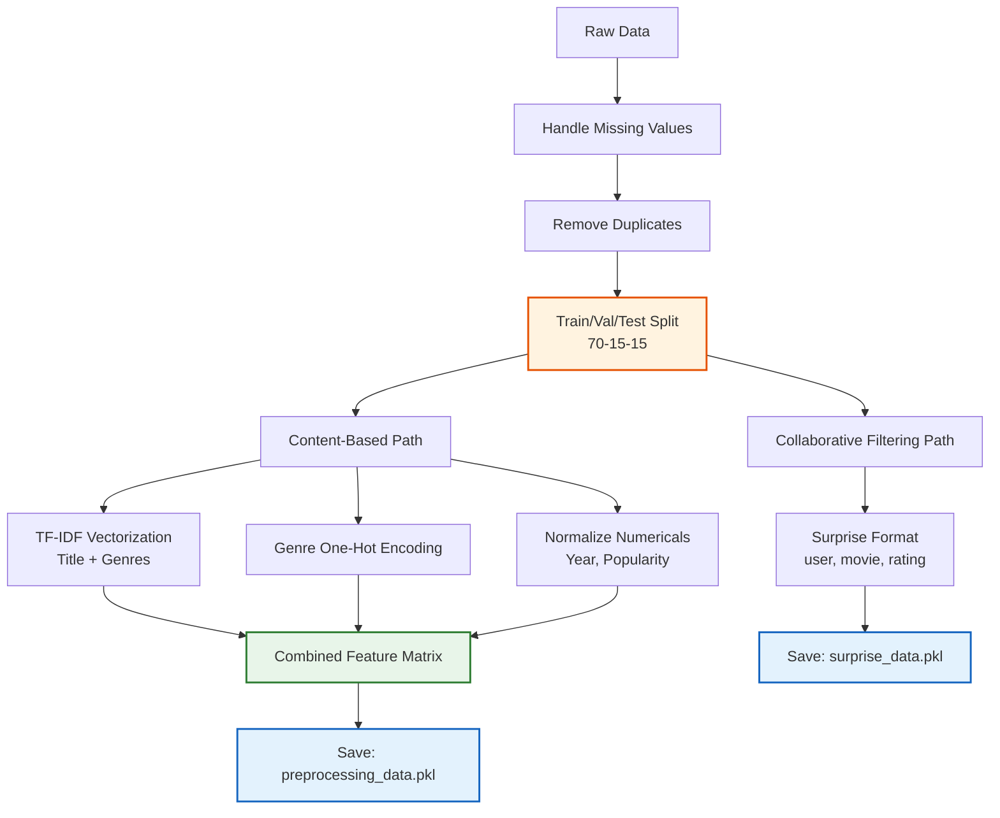

# 🧹 Step 3: Data Preprocessing

## 🎯 **Objective**
Clean, transform, and prepare our data for machine learning. Raw data is messy - we need to make it model-ready!

---

## 📋 **What We'll Do**
1. Handle missing values and duplicates
2. Create train/validation/test splits
3. Prepare data for Collaborative Filtering (Surprise library format)
4. Prepare data for Content-Based Filtering (TF-IDF features)
5. Create combined features for the hybrid model

---

## 🤔 **Why Preprocessing is Critical**

| Problem | Solution | Why It Matters |
|---------|----------|----------------|
| Missing values | Remove or impute | Model can't train on NaN |
| Different scales | Normalization | Fair comparison between features |
| Text data | TF-IDF vectorization | Convert words to numbers |
| Data leakage | Proper train/test split | Get honest evaluation |

---

## 💻 **Code Cells**

### **Cell 1: Load Data (Run if starting fresh)**

```python
# ============================================
# LOAD DATA
# ============================================

import pandas as pd
import numpy as np
import matplotlib.pyplot as plt
import seaborn as sns
from sklearn.model_selection import train_test_split
from sklearn.feature_extraction.text import TfidfVectorizer
from sklearn.preprocessing import MinMaxScaler, LabelEncoder
import pickle
import os
import warnings
warnings.filterwarnings('ignore')

# Paths (using Colab temp storage)
PROJECT_DIR = '/content/MovieRecommender'
DATA_DIR = f'{PROJECT_DIR}/data'
MODEL_DIR = f'{PROJECT_DIR}/models'
EXTRACT_PATH = f'{DATA_DIR}/ml-100k'

# Load datasets
ratings_df = pd.read_csv(
    f"{EXTRACT_PATH}/u.data",
    sep='\t',
    names=['user_id', 'movie_id', 'rating', 'timestamp'],
    encoding='latin-1'
)

movies_df = pd.read_csv(
    f"{EXTRACT_PATH}/u.item",
    sep='|',
    encoding='latin-1',
    names=['movie_id', 'title', 'release_date', 'video_release', 'imdb_url',
           'unknown', 'Action', 'Adventure', 'Animation', 'Children', 'Comedy',
           'Crime', 'Documentary', 'Drama', 'Fantasy', 'Film-Noir', 'Horror',
           'Musical', 'Mystery', 'Romance', 'Sci-Fi', 'Thriller', 'War', 'Western']
)

users_df = pd.read_csv(
    f"{EXTRACT_PATH}/u.user",
    sep='|',
    names=['user_id', 'age', 'gender', 'occupation', 'zip_code'],
    encoding='latin-1'
)

print("✅ Data loaded successfully!")
print(f"   Ratings: {len(ratings_df):,} | Movies: {len(movies_df):,} | Users: {len(users_df):,}")
```

---

### **Cell 2: Check and Handle Missing Values**

```python
# ============================================
# HANDLE MISSING VALUES
# ============================================

print("🔍 CHECKING FOR MISSING VALUES")
print("=" * 50)

# Check each dataframe
print("\n📊 RATINGS DATAFRAME:")
print(ratings_df.isnull().sum())

print("\n🎬 MOVIES DATAFRAME:")
print(movies_df.isnull().sum())

print("\n👥 USERS DATAFRAME:")
print(users_df.isnull().sum())

# Handle missing release dates
print("\n" + "=" * 50)
print("🔧 HANDLING MISSING VALUES")
print("=" * 50)

# Movies: Fill missing release dates with 'Unknown'
movies_df['release_date'] = movies_df['release_date'].fillna('Unknown')

# Movies: Fill video_release (most are NaN - not important for us)
movies_df['video_release'] = movies_df['video_release'].fillna('Unknown')

# Extract year from release date
def extract_year(date_str):
    if date_str == 'Unknown' or pd.isna(date_str):
        return 0
    try:
        return int(date_str.split('-')[-1])
    except:
        return 0

movies_df['year'] = movies_df['release_date'].apply(extract_year)

# Handle year = 0 (unknown) - replace with median
median_year = movies_df[movies_df['year'] > 0]['year'].median()
movies_df['year'] = movies_df['year'].replace(0, int(median_year))

print(f"✅ Missing release dates filled")
print(f"✅ Year extracted (median year for unknowns: {int(median_year)})")

# Verify no missing values in critical columns
print("\n🔍 Verification:")
print(f"   Missing ratings: {ratings_df['rating'].isnull().sum()}")
print(f"   Missing user_ids: {ratings_df['user_id'].isnull().sum()}")
print(f"   Missing movie_ids: {ratings_df['movie_id'].isnull().sum()}")
```

**📝 Explanation:**
- Missing values can crash our model or give wrong results
- For release dates, we extract the year (useful feature)
- Unknown years get the median year (reasonable assumption)

---

### **Cell 3: Remove Duplicates**

```python
# ============================================
# CHECK AND REMOVE DUPLICATES
# ============================================

print("🔍 CHECKING FOR DUPLICATES")
print("=" * 50)

# Check for duplicate ratings (same user, same movie)
duplicate_ratings = ratings_df.duplicated(subset=['user_id', 'movie_id'], keep=False)
print(f"Duplicate user-movie pairs: {duplicate_ratings.sum()}")

# If duplicates exist, keep the latest rating (by timestamp)
if duplicate_ratings.sum() > 0:
    ratings_df = ratings_df.sort_values('timestamp').drop_duplicates(
        subset=['user_id', 'movie_id'], 
        keep='last'
    )
    print(f"✅ Kept latest ratings, new count: {len(ratings_df):,}")
else:
    print("✅ No duplicates found")

# Check for duplicate movies
duplicate_movies = movies_df.duplicated(subset=['title'], keep=False)
print(f"Duplicate movie titles: {duplicate_movies.sum()}")

print("\n✅ Duplicate check complete!")
```

---

### **Cell 4: Create Train/Validation/Test Split**

```python
# ============================================
# TRAIN / VALIDATION / TEST SPLIT
# ============================================
# Split: 70% train, 15% validation, 15% test
# IMPORTANT: Split by ratings, not randomly to avoid data leakage

print("✂️ CREATING DATA SPLITS")
print("=" * 50)

# Shuffle the data first
ratings_shuffled = ratings_df.sample(frac=1, random_state=42).reset_index(drop=True)

# Calculate split points
n = len(ratings_shuffled)
train_end = int(0.70 * n)
val_end = int(0.85 * n)

# Split
train_df = ratings_shuffled[:train_end].copy()
val_df = ratings_shuffled[train_end:val_end].copy()
test_df = ratings_shuffled[val_end:].copy()

print(f"""
📊 SPLIT SUMMARY
─────────────────────────────────────
Training Set:   {len(train_df):,} ratings ({len(train_df)/n*100:.1f}%)
Validation Set: {len(val_df):,} ratings ({len(val_df)/n*100:.1f}%)
Test Set:       {len(test_df):,} ratings ({len(test_df)/n*100:.1f}%)
─────────────────────────────────────
Total:          {len(train_df) + len(val_df) + len(test_df):,} ratings
""")

# Visualize the split
fig, ax = plt.subplots(figsize=(10, 3))
sizes = [len(train_df), len(val_df), len(test_df)]
labels = ['Training (70%)', 'Validation (15%)', 'Test (15%)']
colors = ['#4CAF50', '#FFC107', '#2196F3']

ax.barh(['Data Split'], [sizes[0]], color=colors[0], label=labels[0])
ax.barh(['Data Split'], [sizes[1]], left=[sizes[0]], color=colors[1], label=labels[1])
ax.barh(['Data Split'], [sizes[2]], left=[sizes[0]+sizes[1]], color=colors[2], label=labels[2])

ax.set_xlabel('Number of Ratings')
ax.set_title('Train/Validation/Test Split', fontsize=14, fontweight='bold')
ax.legend(loc='upper right')

plt.tight_layout()
plt.savefig(f'{PROJECT_DIR}/plots/08_data_split.png', dpi=150, bbox_inches='tight')
plt.show()

# Verify no leakage
print("🔍 Checking for data leakage...")
train_users = set(train_df['user_id'])
test_users = set(test_df['user_id'])
cold_start_users = test_users - train_users
print(f"   Users in test but not in train: {len(cold_start_users)} (cold start scenario)")
```

**📝 Explanation:**
- **70-15-15 split**: Industry standard for ML projects
- **Training set**: Model learns patterns from this
- **Validation set**: Tune hyperparameters, prevent overfitting
- **Test set**: Final evaluation (only use once at the end!)
- **Cold start users**: Users in test with no training data - good for testing robustness

---

### **Cell 5: Prepare Data for Surprise (Collaborative Filtering)**

```python
# ============================================
# PREPARE DATA FOR SURPRISE LIBRARY
# ============================================
# Surprise library needs data in a specific format

from surprise import Dataset, Reader

print("📦 PREPARING DATA FOR COLLABORATIVE FILTERING")
print("=" * 50)

# Define the rating scale (1-5 for MovieLens)
reader = Reader(rating_scale=(1, 5))

# Create Surprise datasets
# Training data
train_surprise = Dataset.load_from_df(
    train_df[['user_id', 'movie_id', 'rating']], 
    reader
)
trainset = train_surprise.build_full_trainset()

# Validation data (as testset format for Surprise)
valset = list(zip(
    val_df['user_id'].values,
    val_df['movie_id'].values,
    val_df['rating'].values
))

# Test data
testset = list(zip(
    test_df['user_id'].values,
    test_df['movie_id'].values,
    test_df['rating'].values
))

print(f"""
✅ SURPRISE DATASETS CREATED
─────────────────────────────────────
Training set:   {trainset.n_ratings:,} ratings
                {trainset.n_users:,} users
                {trainset.n_items:,} items

Validation set: {len(valset):,} ratings
Test set:       {len(testset):,} ratings
""")

# Save for later use
surprise_data = {
    'trainset': trainset,
    'valset': valset,
    'testset': testset,
    'reader': reader
}

with open(f'{MODEL_DIR}/surprise_data.pkl', 'wb') as f:
    pickle.dump({'valset': valset, 'testset': testset}, f)

print("💾 Surprise datasets saved!")
```

**📝 Explanation:**
- **Surprise library** is specifically designed for recommendation systems
- It expects data in (user_id, item_id, rating) format
- We save the validation and test sets for later evaluation

---

### **Cell 6: Create Genre Features for Content-Based Filtering**

```python
# ============================================
# CREATE GENRE FEATURES
# ============================================

print("🎭 CREATING GENRE FEATURES")
print("=" * 50)

# Genre columns
genre_cols = ['Action', 'Adventure', 'Animation', 'Children', 'Comedy',
              'Crime', 'Documentary', 'Drama', 'Fantasy', 'Film-Noir',
              'Horror', 'Musical', 'Mystery', 'Romance', 'Sci-Fi',
              'Thriller', 'War', 'Western']

# Create genre string for each movie (for TF-IDF)
movies_df['genres'] = movies_df[genre_cols].apply(
    lambda row: ' '.join([col for col in genre_cols if row[col] == 1]),
    axis=1
)

# Show examples
print("\n🎬 Sample Genre Strings:")
for _, row in movies_df[['title', 'genres']].head(5).iterrows():
    print(f"   {row['title'][:40]}: {row['genres']}")

# Create binary genre matrix (already in data, just extract)
genre_matrix = movies_df[['movie_id'] + genre_cols].copy()
print(f"\n✅ Genre matrix shape: {genre_matrix.shape}")
print(f"   (Each row is a movie, each column is a genre 0/1)")
```

---

### **Cell 7: Create TF-IDF Features from Movie Titles**

```python
# ============================================
# TF-IDF VECTORIZATION
# ============================================
# Convert movie titles to numerical vectors using TF-IDF

print("📝 CREATING TF-IDF FEATURES FROM TITLES")
print("=" * 50)

# Clean titles (remove year in parentheses)
movies_df['clean_title'] = movies_df['title'].str.replace(r'\s*\(\d{4}\)\s*', '', regex=True)

# Combine title, genres for richer text representation
movies_df['combined_features'] = (
    movies_df['clean_title'] + ' ' + 
    movies_df['genres'] + ' ' + 
    movies_df['genres']  # Double weight for genres
)

# Create TF-IDF vectorizer
tfidf = TfidfVectorizer(
    stop_words='english',    # Remove common words (the, is, at, etc.)
    max_features=500,        # Keep top 500 features
    ngram_range=(1, 2)       # Use single words and pairs
)

# Fit and transform
tfidf_matrix = tfidf.fit_transform(movies_df['combined_features'])

print(f"""
✅ TF-IDF MATRIX CREATED
─────────────────────────────────────
Shape: {tfidf_matrix.shape}
       {tfidf_matrix.shape[0]} movies × {tfidf_matrix.shape[1]} features

Sample features (vocabulary):
{list(tfidf.get_feature_names_out()[:20])}
...
""")

# Visualize TF-IDF sparsity
fig, ax = plt.subplots(figsize=(10, 6))
sample_matrix = tfidf_matrix[:50, :100].toarray()
sns.heatmap(sample_matrix, cmap='YlOrRd', ax=ax)
ax.set_title('TF-IDF Matrix Sample (50 movies × 100 features)', fontsize=14, fontweight='bold')
ax.set_xlabel('Feature Index')
ax.set_ylabel('Movie Index')
plt.tight_layout()
plt.savefig(f'{PROJECT_DIR}/plots/09_tfidf_matrix.png', dpi=150, bbox_inches='tight')
plt.show()

print("💡 Higher values (red) = more important words for that movie")
```

**📝 Explanation:**
- **TF-IDF** (Term Frequency-Inverse Document Frequency):
  - Words that appear often in one movie but rarely in others get high scores
  - Common words (like "the") get low scores
- We combine title + genres to create richer features
- This lets us find movies with similar descriptions

---

### **Cell 8: Normalize Numerical Features**

```python
# ============================================
# NORMALIZE NUMERICAL FEATURES
# ============================================

print("📏 NORMALIZING NUMERICAL FEATURES")
print("=" * 50)

# Features to normalize
# Year: older vs newer movies
# Number of ratings: popularity indicator

# Calculate number of ratings per movie
movie_rating_counts = ratings_df.groupby('movie_id').size().reset_index(name='num_ratings')
movie_avg_ratings = ratings_df.groupby('movie_id')['rating'].mean().reset_index(name='avg_rating')

# Merge with movies
movies_df = movies_df.merge(movie_rating_counts, on='movie_id', how='left')
movies_df = movies_df.merge(movie_avg_ratings, on='movie_id', how='left')

# Fill NaN (movies with no ratings in our sample)
movies_df['num_ratings'] = movies_df['num_ratings'].fillna(0)
movies_df['avg_rating'] = movies_df['avg_rating'].fillna(movies_df['avg_rating'].mean())

# Normalize using MinMaxScaler (0-1 range)
scaler = MinMaxScaler()

movies_df['year_normalized'] = scaler.fit_transform(movies_df[['year']])
movies_df['popularity_normalized'] = scaler.fit_transform(movies_df[['num_ratings']])
movies_df['avg_rating_normalized'] = scaler.fit_transform(movies_df[['avg_rating']])

print("""
✅ NORMALIZED FEATURES
─────────────────────────────────────
Feature               Min     Max     Mean
─────────────────────────────────────""")
for col in ['year_normalized', 'popularity_normalized', 'avg_rating_normalized']:
    print(f"{col:25s} {movies_df[col].min():.2f}    {movies_df[col].max():.2f}    {movies_df[col].mean():.2f}")

# Visualize distributions
fig, axes = plt.subplots(1, 3, figsize=(15, 4))

axes[0].hist(movies_df['year_normalized'], bins=30, color='steelblue', edgecolor='white')
axes[0].set_title('Year (Normalized)', fontsize=12, fontweight='bold')
axes[0].set_xlabel('Normalized Value')

axes[1].hist(movies_df['popularity_normalized'], bins=30, color='coral', edgecolor='white')
axes[1].set_title('Popularity (Normalized)', fontsize=12, fontweight='bold')
axes[1].set_xlabel('Normalized Value')

axes[2].hist(movies_df['avg_rating_normalized'], bins=30, color='mediumseagreen', edgecolor='white')
axes[2].set_title('Avg Rating (Normalized)', fontsize=12, fontweight='bold')
axes[2].set_xlabel('Normalized Value')

plt.tight_layout()
plt.savefig(f'{PROJECT_DIR}/plots/10_normalized_features.png', dpi=150, bbox_inches='tight')
plt.show()
```

**📝 Explanation:**
- **Normalization** scales all features to 0-1 range
- Without normalization, features with large values (like year=1997) would dominate
- This ensures fair comparison between features

---

### **Cell 9: Create Final Feature Matrix for Content-Based Model**

```python
# ============================================
# CREATE FINAL FEATURE MATRIX
# ============================================

print("🔧 CREATING FINAL FEATURE MATRIX")
print("=" * 50)

from scipy.sparse import hstack, csr_matrix

# Get genre features as sparse matrix
genre_features = csr_matrix(movies_df[genre_cols].values)

# Get numerical features
numerical_features = csr_matrix(movies_df[[
    'year_normalized', 
    'popularity_normalized', 
    'avg_rating_normalized'
]].values)

# Combine: TF-IDF + Genres + Numerical
final_features = hstack([
    tfidf_matrix,           # Text features (500)
    genre_features,         # Genre features (18)
    numerical_features      # Numerical features (3)
])

print(f"""
✅ FINAL FEATURE MATRIX
─────────────────────────────────────
Total Shape: {final_features.shape}
             {final_features.shape[0]} movies × {final_features.shape[1]} features

Breakdown:
  TF-IDF features:    {tfidf_matrix.shape[1]}
  Genre features:     {len(genre_cols)}
  Numerical features: 3
  ─────────────────────────
  Total:              {final_features.shape[1]}
""")

# Create movie ID to index mapping
movie_id_to_idx = {movie_id: idx for idx, movie_id in enumerate(movies_df['movie_id'])}
idx_to_movie_id = {idx: movie_id for movie_id, idx in movie_id_to_idx.items()}

print("✅ Movie ID mappings created")
```

---

### **Cell 10: Save All Preprocessed Data**

```python
# ============================================
# SAVE PREPROCESSED DATA
# ============================================

print("💾 SAVING PREPROCESSED DATA")
print("=" * 50)

# Save processed dataframes
train_df.to_csv(f'{DATA_DIR}/train_ratings.csv', index=False)
val_df.to_csv(f'{DATA_DIR}/val_ratings.csv', index=False)
test_df.to_csv(f'{DATA_DIR}/test_ratings.csv', index=False)
movies_df.to_csv(f'{DATA_DIR}/movies_processed.csv', index=False)

print("✅ CSV files saved:")
print(f"   - train_ratings.csv ({len(train_df):,} rows)")
print(f"   - val_ratings.csv ({len(val_df):,} rows)")
print(f"   - test_ratings.csv ({len(test_df):,} rows)")
print(f"   - movies_processed.csv ({len(movies_df):,} rows)")

# Save feature matrices and vectorizer
preprocessing_data = {
    'tfidf_matrix': tfidf_matrix,
    'tfidf_vectorizer': tfidf,
    'final_features': final_features,
    'genre_cols': genre_cols,
    'movie_id_to_idx': movie_id_to_idx,
    'idx_to_movie_id': idx_to_movie_id,
    'scaler': scaler
}

with open(f'{MODEL_DIR}/preprocessing_data.pkl', 'wb') as f:
    pickle.dump(preprocessing_data, f)

print(f"\n✅ Preprocessing data saved to: {MODEL_DIR}/preprocessing_data.pkl")

# Summary
print(f"""
═══════════════════════════════════════════════════════
📊 PREPROCESSING COMPLETE - SUMMARY
═══════════════════════════════════════════════════════

Files Created:
─────────────────────────────────────
📁 data/
   ├── train_ratings.csv     (70% of data)
   ├── val_ratings.csv       (15% of data)
   ├── test_ratings.csv      (15% of data)
   └── movies_processed.csv  (with features)

📁 models/
   ├── preprocessing_data.pkl  (TF-IDF, features, mappings)
   └── surprise_data.pkl       (Surprise format data)

Ready For:
─────────────────────────────────────
✅ Collaborative Filtering training (Surprise)
✅ Content-Based model training (TF-IDF + Cosine)
✅ Model evaluation on val/test sets

═══════════════════════════════════════════════════════
➡️ Next: Proceed to 04_model_training.md
═══════════════════════════════════════════════════════
""")
```

---

## 📊 **Preprocessing Pipeline Visualization**



---

## 🔑 **Key Preprocessing Steps Summary**

| Step | Input | Output | Purpose |
|------|-------|--------|---------|
| Missing Values | Raw data | Clean data | Remove NaN that break model |
| Train/Val/Test Split | All ratings | 3 separate sets | Honest evaluation |
| Surprise Format | Ratings | Trainset object | Required by SVD |
| TF-IDF | Title + Genres | 500-dim vectors | Text to numbers |
| Normalization | Year, Popularity | 0-1 scaled values | Fair comparison |
| Feature Matrix | All features | Sparse matrix | Ready for similarity |

---

## ➡️ **Next Step**
Proceed to **04_model_training.md** to train our collaborative and content-based models!

---

*Notebook 3 of 5 | Movie Recommendation System Training*
