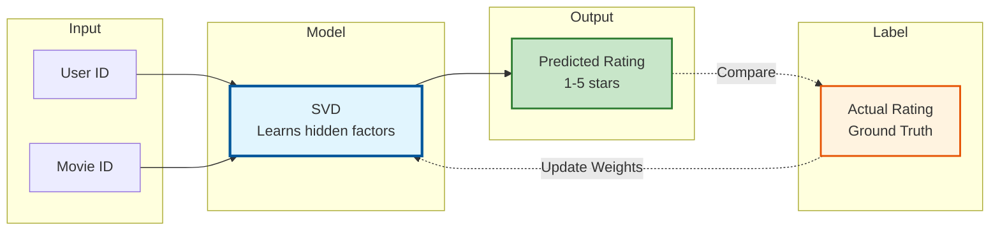
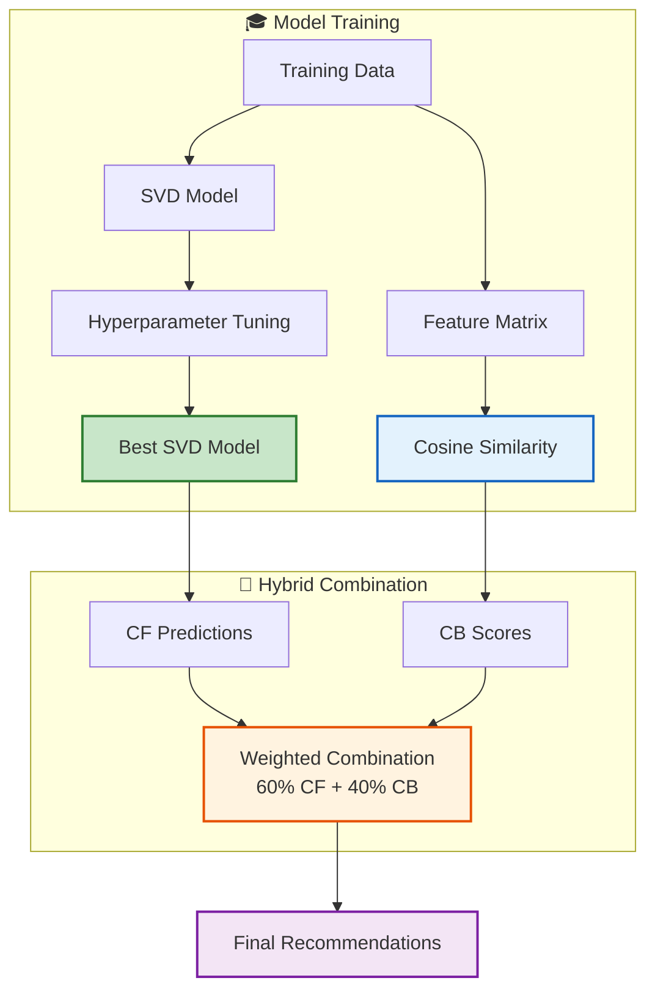

# 🤖 Step 4: Model Training

## 🎯 **Objective**
Train both Collaborative Filtering (SVD) and Content-Based (Cosine Similarity) models, then combine them into a hybrid recommender.

---

## 📋 **What We'll Do**
1. Train SVD model for Collaborative Filtering
2. Tune hyperparameters using validation set
3. Build Content-Based similarity model
4. Combine into Hybrid Recommender
5. Visualize training progress

---

## 🧠 **Understanding Our Models**

### **Supervised Learning in Recommendation Systems**



> **This is SUPERVISED LEARNING because:**
> - We have **labeled data** (actual ratings)
> - The model learns by **comparing predictions to real ratings**
> - The goal is to **minimize prediction error (RMSE)**

---

## 💻 **Code Cells**

### **Cell 1: Load Preprocessed Data**

```python
# ============================================
# LOAD PREPROCESSED DATA
# ============================================

import pandas as pd
import numpy as np
import matplotlib.pyplot as plt
import seaborn as sns
import pickle
import time
from tqdm import tqdm
import warnings
warnings.filterwarnings('ignore')

# Surprise library
from surprise import Dataset, Reader, SVD, SVDpp, NMF, KNNBasic
from surprise import accuracy
from surprise.model_selection import cross_validate, GridSearchCV

# Scikit-learn
from sklearn.metrics.pairwise import cosine_similarity
from scipy.sparse import csr_matrix

# Paths (using Colab temp storage)
PROJECT_DIR = '/content/MovieRecommender'
DATA_DIR = f'{PROJECT_DIR}/data'
MODEL_DIR = f'{PROJECT_DIR}/models'
PLOTS_DIR = f'{PROJECT_DIR}/plots'

# Load ratings
train_df = pd.read_csv(f'{DATA_DIR}/train_ratings.csv')
val_df = pd.read_csv(f'{DATA_DIR}/val_ratings.csv')
test_df = pd.read_csv(f'{DATA_DIR}/test_ratings.csv')
movies_df = pd.read_csv(f'{DATA_DIR}/movies_processed.csv')

# Load preprocessing data
with open(f'{MODEL_DIR}/preprocessing_data.pkl', 'rb') as f:
    prep_data = pickle.load(f)

tfidf_matrix = prep_data['tfidf_matrix']
final_features = prep_data['final_features']
movie_id_to_idx = prep_data['movie_id_to_idx']
idx_to_movie_id = prep_data['idx_to_movie_id']

print("✅ All data loaded successfully!")
print(f"   Training: {len(train_df):,} ratings")
print(f"   Validation: {len(val_df):,} ratings")
print(f"   Test: {len(test_df):,} ratings")
print(f"   Movies: {len(movies_df):,}")
```

---

### **Cell 2: Prepare Surprise Dataset**

```python
# ============================================
# PREPARE SURPRISE DATASET
# ============================================

print("📦 PREPARING DATA FOR SVD TRAINING")
print("=" * 50)

# Create Reader with rating scale
reader = Reader(rating_scale=(1, 5))

# Create training dataset
train_surprise = Dataset.load_from_df(
    train_df[['user_id', 'movie_id', 'rating']], 
    reader
)
trainset = train_surprise.build_full_trainset()

# Create validation and test sets (as anti-testset format)
valset = [(row['user_id'], row['movie_id'], row['rating']) 
          for _, row in val_df.iterrows()]

testset = [(row['user_id'], row['movie_id'], row['rating']) 
           for _, row in test_df.iterrows()]

print(f"✅ Training set: {trainset.n_ratings:,} ratings")
print(f"✅ Validation set: {len(valset):,} ratings")
print(f"✅ Test set: {len(testset):,} ratings")
```

---

### **Cell 3: Train Basic SVD Model**

```python
# ============================================
# TRAIN BASIC SVD MODEL
# ============================================
# SVD = Singular Value Decomposition
# It learns hidden "factors" for users and movies

print("🎓 TRAINING SVD MODEL (Collaborative Filtering)")
print("=" * 50)

# Create SVD model with default parameters
svd_model = SVD(
    n_factors=100,      # Number of hidden factors
    n_epochs=20,        # Training iterations
    lr_all=0.005,       # Learning rate
    reg_all=0.02,       # Regularization (prevents overfitting)
    random_state=42,
    verbose=True
)

# Train the model
print("\n📊 Training Progress:")
start_time = time.time()
svd_model.fit(trainset)
training_time = time.time() - start_time

print(f"\n✅ Training completed in {training_time:.2f} seconds")

# Evaluate on validation set
print("\n📈 Evaluating on Validation Set...")
val_predictions = svd_model.test(valset)
val_rmse = accuracy.rmse(val_predictions)
val_mae = accuracy.mae(val_predictions)

print(f"""
═══════════════════════════════════════════════════════
📊 BASIC SVD MODEL RESULTS
═══════════════════════════════════════════════════════
RMSE (Validation): {val_rmse:.4f}
MAE (Validation):  {val_mae:.4f}
Training Time:     {training_time:.2f} seconds

💡 INTERPRETATION:
• RMSE of {val_rmse:.4f} means predictions are off by ~{val_rmse:.2f} stars on average
• Our target is RMSE < 0.90 - {'✅ ACHIEVED!' if val_rmse < 0.90 else '❌ Need to tune hyperparameters'}
═══════════════════════════════════════════════════════
""")
```

**📝 Explanation:**
- **SVD (Singular Value Decomposition)** finds hidden patterns in user-movie ratings
- **n_factors=100**: The model learns 100 hidden characteristics for each user and movie
- **n_epochs=20**: How many times to go through all data
- **reg_all=0.02**: Regularization prevents overfitting (memorizing instead of learning)

---

### **Cell 4: Hyperparameter Tuning with Grid Search**

```python
# ============================================
# HYPERPARAMETER TUNING
# ============================================
# Find the best settings for our model

print("🔧 HYPERPARAMETER TUNING (This may take a few minutes)")
print("=" * 50)

# Define parameter grid
param_grid = {
    'n_factors': [50, 100, 150],        # Number of latent factors
    'n_epochs': [20, 30],                # Number of epochs
    'lr_all': [0.002, 0.005, 0.01],      # Learning rate
    'reg_all': [0.02, 0.05, 0.1]         # Regularization
}

print(f"Testing {np.prod([len(v) for v in param_grid.values()])} combinations...")

# Run grid search with cross-validation
gs = GridSearchCV(
    SVD, 
    param_grid, 
    measures=['rmse', 'mae'], 
    cv=3,  # 3-fold cross-validation
    n_jobs=-1  # Use all CPU cores
)

gs.fit(train_surprise)

# Best parameters
best_params = gs.best_params['rmse']
best_rmse = gs.best_score['rmse']

print(f"""
═══════════════════════════════════════════════════════
🏆 BEST HYPERPARAMETERS FOUND
═══════════════════════════════════════════════════════
n_factors:  {best_params['n_factors']}
n_epochs:   {best_params['n_epochs']}
lr_all:     {best_params['lr_all']}
reg_all:    {best_params['reg_all']}

Best CV RMSE: {best_rmse:.4f}
═══════════════════════════════════════════════════════
""")

# Visualize hyperparameter importance
results_df = pd.DataFrame(gs.cv_results)
```

**📝 Explanation:**
- **Grid Search** tries all combinations of hyperparameters
- **Cross-Validation** ensures results are reliable (not lucky)
- We find the best settings automatically

---

### **Cell 5: Train Tuned SVD Model**

```python
# ============================================
# TRAIN TUNED SVD MODEL
# ============================================

print("🎓 TRAINING TUNED SVD MODEL")
print("=" * 50)

# Create model with best parameters
best_svd = SVD(
    n_factors=best_params['n_factors'],
    n_epochs=best_params['n_epochs'],
    lr_all=best_params['lr_all'],
    reg_all=best_params['reg_all'],
    random_state=42,
    verbose=True
)

# Train
start_time = time.time()
best_svd.fit(trainset)
training_time = time.time() - start_time

# Evaluate
val_predictions = best_svd.test(valset)
val_rmse = accuracy.rmse(val_predictions)
val_mae = accuracy.mae(val_predictions)

print(f"""
═══════════════════════════════════════════════════════
📊 TUNED SVD MODEL RESULTS
═══════════════════════════════════════════════════════
RMSE (Validation): {val_rmse:.4f}
MAE (Validation):  {val_mae:.4f}
Training Time:     {training_time:.2f} seconds

Target: RMSE < 0.90
Status: {'✅ TARGET ACHIEVED!' if val_rmse < 0.90 else '⚠️ Close to target'}
═══════════════════════════════════════════════════════
""")

# Store the model
cf_model = best_svd
```

---

### **Cell 6: Visualize Prediction Distribution**

```python
# ============================================
# VISUALIZE PREDICTIONS
# ============================================

print("📊 VISUALIZING PREDICTION QUALITY")
print("=" * 50)

# Get actual and predicted ratings
actuals = [pred.r_ui for pred in val_predictions]
predictions = [pred.est for pred in val_predictions]
errors = [pred.r_ui - pred.est for pred in val_predictions]

fig, axes = plt.subplots(2, 2, figsize=(14, 10))

# Plot 1: Actual vs Predicted scatter
ax1 = axes[0, 0]
ax1.scatter(actuals, predictions, alpha=0.3, s=10)
ax1.plot([1, 5], [1, 5], 'r--', linewidth=2, label='Perfect Prediction')
ax1.set_xlabel('Actual Rating', fontsize=12)
ax1.set_ylabel('Predicted Rating', fontsize=12)
ax1.set_title('Actual vs Predicted Ratings', fontsize=14, fontweight='bold')
ax1.legend()
ax1.set_xlim(0.5, 5.5)
ax1.set_ylim(0.5, 5.5)

# Plot 2: Error distribution
ax2 = axes[0, 1]
ax2.hist(errors, bins=50, color='steelblue', edgecolor='white', alpha=0.7)
ax2.axvline(0, color='red', linestyle='--', linewidth=2, label='Zero Error')
ax2.set_xlabel('Prediction Error (Actual - Predicted)', fontsize=12)
ax2.set_ylabel('Frequency', fontsize=12)
ax2.set_title('Error Distribution', fontsize=14, fontweight='bold')
ax2.legend()

# Plot 3: Predicted rating distribution
ax3 = axes[1, 0]
ax3.hist(predictions, bins=30, color='coral', edgecolor='white', alpha=0.7, label='Predicted')
ax3.hist(actuals, bins=30, color='steelblue', edgecolor='white', alpha=0.5, label='Actual')
ax3.set_xlabel('Rating', fontsize=12)
ax3.set_ylabel('Frequency', fontsize=12)
ax3.set_title('Rating Distribution: Actual vs Predicted', fontsize=14, fontweight='bold')
ax3.legend()

# Plot 4: Error by actual rating
ax4 = axes[1, 1]
error_by_rating = pd.DataFrame({'actual': actuals, 'error': np.abs(errors)})
error_by_rating.groupby('actual')['error'].mean().plot(kind='bar', ax=ax4, color='mediumpurple')
ax4.set_xlabel('Actual Rating', fontsize=12)
ax4.set_ylabel('Mean Absolute Error', fontsize=12)
ax4.set_title('Error by Rating Category', fontsize=14, fontweight='bold')
ax4.set_xticklabels(ax4.get_xticklabels(), rotation=0)

plt.tight_layout()
plt.savefig(f'{PLOTS_DIR}/11_svd_predictions.png', dpi=150, bbox_inches='tight')
plt.show()

print("""
💡 INSIGHTS FROM PLOTS:
• Points close to red line = good predictions
• Error distribution centered at 0 = unbiased model
• Larger errors for extreme ratings (1 and 5) is normal
""")
```

---

### **Cell 7: Build Content-Based Model**

```python
# ============================================
# CONTENT-BASED MODEL
# ============================================
# Uses movie features (genres, title) to find similar movies

print("🎬 BUILDING CONTENT-BASED MODEL")
print("=" * 50)

# Calculate cosine similarity between all movies
# Using the combined feature matrix from preprocessing

print("Computing cosine similarity matrix...")
start_time = time.time()

# Convert to dense for small dataset (for large datasets, use sparse operations)
cosine_sim = cosine_similarity(final_features, final_features)

compute_time = time.time() - start_time
print(f"✅ Similarity matrix computed in {compute_time:.2f} seconds")
print(f"   Shape: {cosine_sim.shape}")

# Create a DataFrame for easier lookup
similarity_df = pd.DataFrame(
    cosine_sim,
    index=movies_df['movie_id'],
    columns=movies_df['movie_id']
)

print(f"""
═══════════════════════════════════════════════════════
📊 CONTENT-BASED MODEL READY
═══════════════════════════════════════════════════════
Matrix Size:    {cosine_sim.shape[0]} × {cosine_sim.shape[1]}
Memory Size:    {cosine_sim.nbytes / 1024 / 1024:.2f} MB
Compute Time:   {compute_time:.2f} seconds
═══════════════════════════════════════════════════════
""")
```

**📝 Explanation:**
- **Cosine Similarity** measures how similar two movies are based on their features
- Value of 1.0 = identical, 0.0 = completely different
- This creates a matrix where we can look up similarity between any two movies

---

### **Cell 8: Test Content-Based Recommendations**

```python
# ============================================
# TEST CONTENT-BASED RECOMMENDATIONS
# ============================================

def get_similar_movies(movie_id, n=10):
    """Get n most similar movies to the given movie"""
    if movie_id not in similarity_df.index:
        return []
    
    # Get similarity scores
    sim_scores = similarity_df[movie_id].sort_values(ascending=False)
    
    # Exclude the movie itself and get top n
    sim_scores = sim_scores.drop(movie_id)
    top_similar = sim_scores.head(n)
    
    # Get movie details
    results = []
    for mid, score in top_similar.items():
        movie = movies_df[movies_df['movie_id'] == mid].iloc[0]
        results.append({
            'movie_id': mid,
            'title': movie['title'],
            'genres': movie['genres'],
            'similarity': score
        })
    
    return results

# Test with a popular movie
test_movie_id = 50  # Star Wars (1977)
test_movie = movies_df[movies_df['movie_id'] == test_movie_id].iloc[0]

print(f"🎬 TESTING CONTENT-BASED RECOMMENDATIONS")
print("=" * 50)
print(f"\n📽️ Input Movie: {test_movie['title']}")
print(f"   Genres: {test_movie['genres']}")
print("\n🎯 Top 10 Similar Movies:")
print("-" * 50)

similar_movies = get_similar_movies(test_movie_id, n=10)
for i, movie in enumerate(similar_movies, 1):
    print(f"{i:2d}. {movie['title'][:45]:45s} (Sim: {movie['similarity']:.3f})")
    print(f"    Genres: {movie['genres']}")
```

---

### **Cell 9: Create Hybrid Recommender Class**

```python
# ============================================
# HYBRID RECOMMENDER
# ============================================
# Combines Collaborative Filtering + Content-Based

class HybridRecommender:
    """
    Hybrid Recommendation System
    
    Combines:
    - Collaborative Filtering (SVD): Predicts ratings based on user patterns
    - Content-Based (Cosine Similarity): Finds similar movies by features
    
    This is SUPERVISED LEARNING because we use actual ratings as labels
    to train the SVD model.
    """
    
    def __init__(self, cf_model, similarity_matrix, movies_df, cf_weight=0.6):
        """
        Initialize the hybrid recommender.
        
        Parameters:
        - cf_model: Trained SVD model from Surprise
        - similarity_matrix: Cosine similarity matrix for content-based
        - movies_df: DataFrame with movie information
        - cf_weight: Weight for collaborative filtering (0-1)
                     Content weight = 1 - cf_weight
        """
        self.cf_model = cf_model
        self.similarity_matrix = similarity_matrix
        self.movies_df = movies_df
        self.cf_weight = cf_weight
        self.cb_weight = 1 - cf_weight
        
    def get_cf_predictions(self, user_id, movie_ids):
        """Get collaborative filtering predictions for a user."""
        predictions = {}
        for movie_id in movie_ids:
            try:
                pred = self.cf_model.predict(user_id, movie_id)
                predictions[movie_id] = pred.est
            except:
                predictions[movie_id] = 3.0  # Default for unknown
        return predictions
    
    def get_cb_scores(self, liked_movies, candidate_movies):
        """Get content-based scores based on movies user liked."""
        if not liked_movies:
            return {m: 0.5 for m in candidate_movies}
        
        scores = {}
        for candidate in candidate_movies:
            if candidate in self.similarity_matrix.index:
                # Average similarity to liked movies
                sims = []
                for liked in liked_movies:
                    if liked in self.similarity_matrix.columns:
                        sims.append(self.similarity_matrix.loc[candidate, liked])
                scores[candidate] = np.mean(sims) if sims else 0.5
            else:
                scores[candidate] = 0.5
        return scores
    
    def recommend(self, user_id, user_history=None, n=10, exclude_watched=True):
        """
        Generate hybrid recommendations for a user.
        
        Parameters:
        - user_id: The user to recommend for
        - user_history: List of (movie_id, rating) tuples the user has rated
        - n: Number of recommendations
        - exclude_watched: Whether to exclude already watched movies
        
        Returns:
        - List of recommended movie dictionaries
        """
        # Get all movie IDs
        all_movies = set(self.movies_df['movie_id'].values)
        
        # Exclude watched movies if requested
        if exclude_watched and user_history:
            watched = set([m[0] for m in user_history])
            candidate_movies = list(all_movies - watched)
        else:
            candidate_movies = list(all_movies)
        
        # Get liked movies (rated 4+)
        liked_movies = []
        if user_history:
            liked_movies = [m[0] for m in user_history if m[1] >= 4]
        
        # Get predictions from both models
        cf_preds = self.get_cf_predictions(user_id, candidate_movies)
        cb_scores = self.get_cb_scores(liked_movies, candidate_movies)
        
        # Normalize scores to 0-1 range
        cf_values = list(cf_preds.values())
        cf_min, cf_max = min(cf_values), max(cf_values)
        if cf_max > cf_min:
            cf_norm = {k: (v - cf_min) / (cf_max - cf_min) for k, v in cf_preds.items()}
        else:
            cf_norm = {k: 0.5 for k in cf_preds}
        
        # Combine scores
        hybrid_scores = {}
        for movie_id in candidate_movies:
            cf_score = cf_norm.get(movie_id, 0.5)
            cb_score = cb_scores.get(movie_id, 0.5)
            hybrid_scores[movie_id] = (
                self.cf_weight * cf_score + 
                self.cb_weight * cb_score
            )
        
        # Sort and get top n
        sorted_movies = sorted(hybrid_scores.items(), key=lambda x: x[1], reverse=True)[:n]
        
        # Format results
        recommendations = []
        for movie_id, score in sorted_movies:
            movie = self.movies_df[self.movies_df['movie_id'] == movie_id].iloc[0]
            recommendations.append({
                'movie_id': movie_id,
                'title': movie['title'],
                'genres': movie['genres'],
                'hybrid_score': score,
                'cf_score': cf_preds.get(movie_id, 0),
                'cb_score': cb_scores.get(movie_id, 0)
            })
        
        return recommendations

# Create hybrid recommender
hybrid_model = HybridRecommender(
    cf_model=cf_model,
    similarity_matrix=similarity_df,
    movies_df=movies_df,
    cf_weight=0.6  # 60% collaborative, 40% content-based
)

print("✅ Hybrid Recommender created!")
print(f"   CF Weight: 60%")
print(f"   CB Weight: 40%")
```

**📝 Explanation:**
- The Hybrid model combines both approaches with configurable weights
- **cf_weight=0.6**: Collaborative filtering contributes 60% to final score
- **cb_weight=0.4**: Content-based contributes 40%
- This balances personalization (CF) with content similarity (CB)

---

### **Cell 10: Test Hybrid Recommender**

```python
# ============================================
# TEST HYBRID RECOMMENDER
# ============================================

print("🎯 TESTING HYBRID RECOMMENDER")
print("=" * 50)

# Simulate a user's history
test_user_id = 1
user_ratings = train_df[train_df['user_id'] == test_user_id][['movie_id', 'rating']]
user_history = list(user_ratings.itertuples(index=False, name=None))

# Show user's top rated movies
print(f"\n👤 User {test_user_id}'s Top Rated Movies:")
print("-" * 50)
top_rated = user_ratings.nlargest(5, 'rating')
for _, row in top_rated.iterrows():
    movie = movies_df[movies_df['movie_id'] == row['movie_id']].iloc[0]
    print(f"⭐ {row['rating']:.0f} - {movie['title']}")

# Get recommendations
print(f"\n🎬 Hybrid Recommendations for User {test_user_id}:")
print("-" * 50)
recommendations = hybrid_model.recommend(
    user_id=test_user_id,
    user_history=user_history,
    n=10
)

for i, rec in enumerate(recommendations, 1):
    print(f"{i:2d}. {rec['title'][:45]:45s}")
    print(f"    Score: {rec['hybrid_score']:.3f} (CF: {rec['cf_score']:.2f}, CB: {rec['cb_score']:.3f})")
    print(f"    Genres: {rec['genres']}")
```

---

### **Cell 11: Visualize Model Weights Impact**

```python
# ============================================
# VISUALIZE WEIGHT IMPACT
# ============================================

print("📊 ANALYZING HYBRID WEIGHT IMPACT")
print("=" * 50)

# Test different weight combinations
weights = [0.0, 0.2, 0.4, 0.6, 0.8, 1.0]
results = []

for cf_w in weights:
    temp_model = HybridRecommender(
        cf_model=cf_model,
        similarity_matrix=similarity_df,
        movies_df=movies_df,
        cf_weight=cf_w
    )
    
    recs = temp_model.recommend(test_user_id, user_history, n=10)
    movie_titles = [r['title'][:30] for r in recs]
    
    results.append({
        'cf_weight': cf_w,
        'cb_weight': 1 - cf_w,
        'recommendations': movie_titles
    })

# Display comparison
print("\n🔄 RECOMMENDATIONS BY WEIGHT COMBINATION:")
print("-" * 60)
for r in results:
    print(f"\nCF={r['cf_weight']*100:.0f}% / CB={r['cb_weight']*100:.0f}%:")
    for i, title in enumerate(r['recommendations'][:5], 1):
        print(f"  {i}. {title}")
```

---

### **Cell 12: Save Trained Models**

```python
# ============================================
# SAVE TRAINED MODELS
# ============================================

print("💾 SAVING TRAINED MODELS")
print("=" * 50)

# Save collaborative filtering model
with open(f'{MODEL_DIR}/cf_model.pkl', 'wb') as f:
    pickle.dump(cf_model, f)
print("✅ cf_model.pkl saved")

# Save similarity matrix
with open(f'{MODEL_DIR}/similarity_matrix.pkl', 'wb') as f:
    pickle.dump(similarity_df, f)
print("✅ similarity_matrix.pkl saved")

# Save hybrid model configuration
hybrid_config = {
    'cf_weight': 0.6,
    'cb_weight': 0.4,
    'best_params': best_params,
    'val_rmse': val_rmse
}
with open(f'{MODEL_DIR}/hybrid_config.pkl', 'wb') as f:
    pickle.dump(hybrid_config, f)
print("✅ hybrid_config.pkl saved")

print(f"""
═══════════════════════════════════════════════════════
📦 MODEL TRAINING COMPLETE
═══════════════════════════════════════════════════════

Saved Files:
─────────────────────────────────────
📁 models/
   ├── cf_model.pkl          (SVD collaborative filtering)
   ├── similarity_matrix.pkl (Content-based similarity)
   └── hybrid_config.pkl     (Model configuration)

Model Performance:
─────────────────────────────────────
RMSE (Validation): {val_rmse:.4f}
Target:            < 0.90
Status:            {'✅ ACHIEVED!' if val_rmse < 0.90 else '⚠️ Close'}

═══════════════════════════════════════════════════════
➡️ Next: Proceed to 05_model_evaluation.md
═══════════════════════════════════════════════════════
""")
```

---

## 📊 **Training Summary**



---

## 🔑 **Key Concepts Covered**

| Concept | Explanation |
|---------|-------------|
| **Supervised Learning** | Model learns from labeled data (actual ratings) |
| **SVD** | Finds hidden factors in user-movie interactions |
| **Hyperparameter Tuning** | Finding optimal model settings |
| **Grid Search** | Trying all parameter combinations |
| **Cosine Similarity** | Measures how similar two movies are |
| **Hybrid Model** | Combines CF + CB for better results |

---

## ➡️ **Next Step**
Proceed to **05_model_evaluation.md** for thorough testing and metrics!

---

*Notebook 4 of 5 | Movie Recommendation System Training*
