# 📚 Colab Training Notebooks - Overview

## 🎯 **Purpose**
These notebooks guide you step-by-step through training a Movie Recommendation AI System on Google Colab.

---

## 📋 **Notebook Structure**

```mermaid
graph TD
    A[01 Setup & Installation] --> B[02 Data Exploration EDA]
    B --> C[03 Data Preprocessing]
    C --> D[04 Model Training]
    D --> E[05 Evaluation & Export]
    E --> F[🌐 Web Integration]
    
    style A fill:#e3f2fd,stroke:#1565c0,stroke-width:2px
    style B fill:#f3e5f5,stroke:#7b1fa2,stroke-width:2px
    style C fill:#fff3e0,stroke:#ef6c00,stroke-width:2px
    style D fill:#e8f5e9,stroke:#2e7d32,stroke-width:2px
    style E fill:#fce4ec,stroke:#c2185b,stroke-width:2px
    style F fill:#e0f2f1,stroke:#00695c,stroke-width:2px
```



---

## 📓 **Notebooks**

### **01 - Setup and Installation** 
`01_setup_and_installation.md`

| Duration | Difficulty | Key Concepts |
|----------|------------|--------------|
| 10 min | ⭐ Easy | Environment setup, libraries |

**What You'll Do:**
- Install required Python packages
- Connect to Google Drive
- Download MovieLens dataset
- Verify setup works

**Output:**
- ✅ All libraries installed
- ✅ Dataset downloaded
- ✅ Project folders created

---

### **02 - Data Exploration (EDA)**
`02_data_exploration.md`

| Duration | Difficulty | Key Concepts |
|----------|------------|--------------|
| 30 min | ⭐⭐ Medium | EDA, visualization, statistics |

**What You'll Do:**
- Analyze rating distribution
- Explore user activity patterns
- Study movie popularity
- Visualize data sparsity

**Key Findings:**
- Positive bias in ratings (most 3-5 stars)
- 99%+ matrix sparsity (most ratings missing)
- Power users rate much more than average
- Drama/Comedy genres dominate

**Plots Generated:** 7

---

### **03 - Data Preprocessing**
`03_data_preprocessing.md`

| Duration | Difficulty | Key Concepts |
|----------|------------|--------------|
| 25 min | ⭐⭐ Medium | Data cleaning, feature engineering, TF-IDF |

**What You'll Do:**
- Handle missing values
- Create train/validation/test splits
- Build TF-IDF features from text
- Normalize numerical features
- Create movie feature matrix

**Output:**
- `train_ratings.csv` (70%)
- `val_ratings.csv` (15%)
- `test_ratings.csv` (15%)
- `preprocessing_data.pkl`

---

### **04 - Model Training**
`04_model_training.md`

| Duration | Difficulty | Key Concepts |
|----------|------------|--------------|
| 45 min | ⭐⭐⭐ Hard | SVD, hyperparameter tuning, hybrid models |

**What You'll Do:**
- Train SVD collaborative filtering model
- Perform hyperparameter tuning with Grid Search
- Build content-based similarity model
- Combine into hybrid recommender

**Key Concepts:**
- **Supervised Learning**: We use actual ratings as labels
- **Matrix Factorization**: SVD finds hidden patterns
- **Cosine Similarity**: Measures movie similarity

**Output:**
- `cf_model.pkl`
- `similarity_matrix.pkl`
- `hybrid_config.pkl`

---

### **05 - Model Evaluation & Export**
`05_model_evaluation.md`

| Duration | Difficulty | Key Concepts |
|----------|------------|--------------|
| 30 min | ⭐⭐ Medium | Metrics, evaluation, deployment |

**What You'll Do:**
- Evaluate on test set (final honest evaluation)
- Calculate Precision@K and Recall@K
- Analyze recommendation diversity
- Test cold start handling
- Export models for web deployment

**Metrics Covered:**
- RMSE / MAE (accuracy)
- Precision@K / Recall@K (ranking quality)
- Intra-List Similarity (diversity)
- Cold start performance

**Output:**
- `/export/` folder with all deployment files
- Performance report

---

## 🎓 **Learning Outcomes**


---

## ⏱️ **Total Time**

| Phase | Duration |
|-------|----------|
| Setup | 10 min |
| Exploration | 30 min |
| Preprocessing | 25 min |
| Training | 45 min |
| Evaluation | 30 min |
| **Total** | **~2.5 hours** |

---

## 🚀 **Quick Start**

1. Open Google Colab: https://colab.research.google.com
2. Create a new notebook
3. Copy cells from `01_setup_and_installation.md`
4. Run each cell in order
5. Continue with notebooks 02-05

---

## 💡 **Tips for Success**

| Tip | Why |
|-----|-----|
| Run cells in order | Later cells depend on earlier ones |
| Save to Google Drive | Colab resets after ~12 hours |
| Check output carefully | Errors early = problems later |
| Experiment freely | Change parameters and see what happens |
| Read explanations | Understanding > just running code |

---

## ❓ **Troubleshooting**

| Problem | Solution |
|---------|----------|
| `ModuleNotFoundError` | Re-run installation cell |
| Memory error | Restart runtime, use smaller data |
| Model won't fit | Check data types, reduce features |
| Poor performance | Tune hyperparameters, check data |

---

## 📁 **Files Generated**

After completing all notebooks:

```
📁 Google Drive/MovieRecommender/
├── 📁 data/
│   ├── ml-100k/              # Raw dataset
│   ├── train_ratings.csv
│   ├── val_ratings.csv
│   ├── test_ratings.csv
│   └── movies_processed.csv
├── 📁 models/
│   ├── cf_model.pkl
│   ├── similarity_matrix.pkl
│   ├── preprocessing_data.pkl
│   └── hybrid_config.pkl
├── 📁 plots/
│   ├── 01_rating_distribution.png
│   ├── 02_user_activity.png
│   ├── ... (16 plots total)
│   └── 16_final_summary.png
└── 📁 export/
    ├── cf_model.pkl
    ├── similarity_matrix.pkl
    ├── movies_data.pkl
    ├── preprocessing_data.pkl
    ├── metadata.pkl
    └── README.md
```

---

## ➡️ **After Training**

Once you complete all notebooks:

1. **Download** the `export/` folder from Google Drive
2. **Place** the `.pkl` files in your web app's `models/` folder
3. **Load** models with pickle in your Flask/Streamlit app
4. **Deploy** and start recommending movies! 🎬

---

*Happy Training! 🚀*
